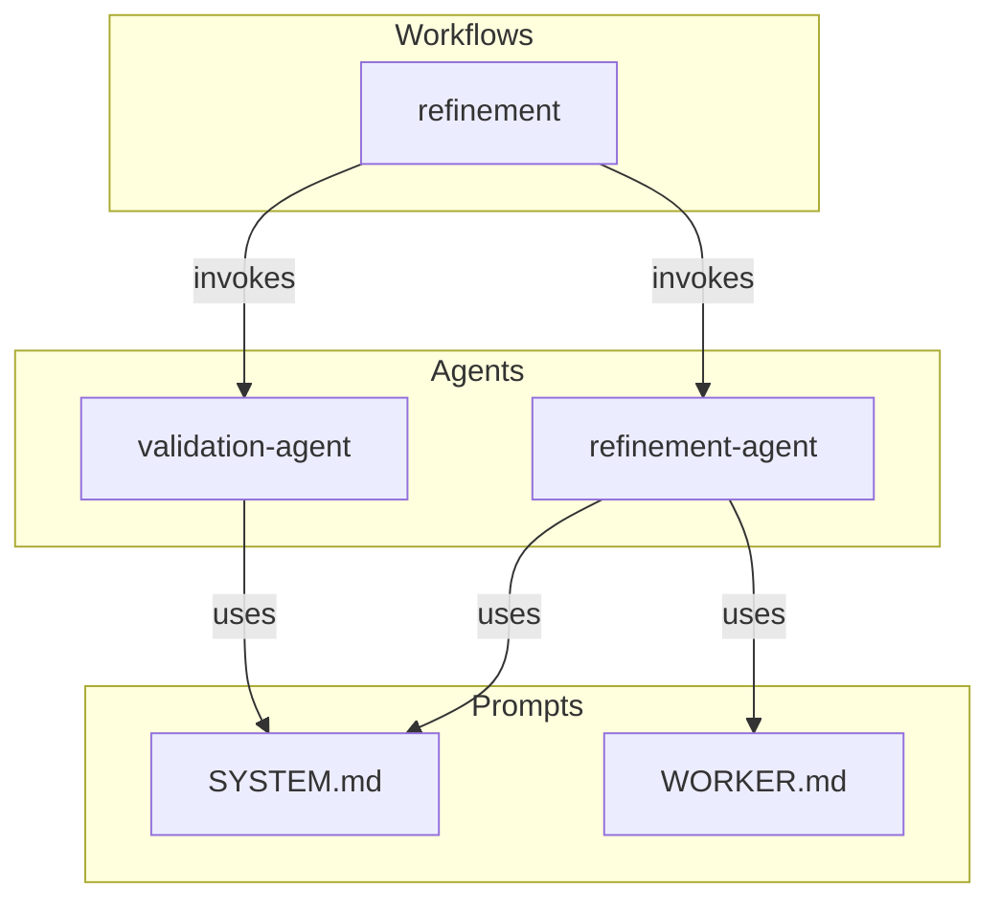

# Dependency Graph Specification

**Status**: Specification  
**Source**: CA-014 (Incrementalist EmitDependencyGraphTask.cs pattern)

## Overview

This document specifies the structure and algorithms for the AGENT-33 dependency graph.

## Graph Structure

### Node Types

```python
from dataclasses import dataclass
from typing import List, Dict, Any, Literal
from enum import Enum

class NodeType(Enum):
    WORKFLOW = "workflow"
    AGENT = "agent"
    ARTIFACT = "artifact"
    TEMPLATE = "template"
    PROMPT = "prompt"

@dataclass
class GraphNode:
    """A node in the dependency graph."""
    id: str  # Unique identifier
    type: NodeType
    path: str  # File path (if applicable)
    name: str  # Human-readable name
    metadata: Dict[str, Any]
    
    # Cached relationships
    _dependencies: List[str] = None
    _dependents: List[str] = None
```

### Edge Types

```python
class EdgeType(Enum):
    INVOKES = "invokes"      # Workflow → Agent
    PROCESSES = "processes"   # Agent → Artifact
    IMPORTS = "imports"       # Artifact → Artifact
    EXTENDS = "extends"       # Template inheritance
    USES = "uses"            # General usage
    TRIGGERS = "triggers"     # Trigger relationship

@dataclass
class GraphEdge:
    """An edge in the dependency graph."""
    source: str  # Source node ID
    target: str  # Target node ID
    type: EdgeType
    weight: float = 1.0  # For path calculations
    metadata: Dict[str, Any] = None
```

### Graph Container

```python
@dataclass
class DependencyGraph:
    """Container for the full dependency graph."""
    nodes: Dict[str, GraphNode]
    edges: List[GraphEdge]
    version: str
    built_at: str
    
    def add_node(self, node: GraphNode) -> None:
        self.nodes[node.id] = node
    
    def add_edge(self, edge: GraphEdge) -> None:
        self.edges.append(edge)
    
    def get_dependencies(self, node_id: str) -> List[str]:
        """Get all nodes this node depends on."""
        return [e.target for e in self.edges if e.source == node_id]
    
    def get_dependents(self, node_id: str) -> List[str]:
        """Get all nodes that depend on this node."""
        return [e.source for e in self.edges if e.target == node_id]
```

## Graph Algorithms

### Transitive Closure

Find all transitively affected nodes:

```python
def transitive_closure(
    graph: DependencyGraph,
    start_nodes: List[str],
    direction: Literal["dependencies", "dependents"] = "dependents"
) -> Set[str]:
    """
    Find all transitively reachable nodes.
    
    Args:
        graph: The dependency graph
        start_nodes: Starting node IDs
        direction: Which edges to follow
        
    Returns:
        Set of all reachable node IDs
    """
    visited = set()
    queue = list(start_nodes)
    
    while queue:
        node_id = queue.pop(0)
        if node_id in visited:
            continue
        
        visited.add(node_id)
        
        if direction == "dependents":
            neighbors = graph.get_dependents(node_id)
        else:
            neighbors = graph.get_dependencies(node_id)
        
        for neighbor in neighbors:
            if neighbor not in visited:
                queue.append(neighbor)
    
    return visited
```

### Topological Levels

Group nodes by dependency depth:

```python
def topological_levels(
    graph: DependencyGraph,
    node_ids: Set[str]
) -> List[List[str]]:
    """
    Group nodes into dependency levels.
    
    Level 0: No dependencies
    Level 1: Depends only on level 0
    Level N: Depends only on levels < N
    
    Returns:
        List of levels, each containing node IDs
    """
    # Build subgraph
    subgraph_edges = [
        e for e in graph.edges
        if e.source in node_ids and e.target in node_ids
    ]
    
    # Calculate in-degrees
    in_degree = {n: 0 for n in node_ids}
    for edge in subgraph_edges:
        in_degree[edge.source] += 1
    
    levels = []
    remaining = set(node_ids)
    
    while remaining:
        # Current level: nodes with no remaining dependencies
        level = [n for n in remaining if in_degree[n] == 0]
        
        if not level:
            raise CycleDetectedError("Circular dependency detected")
        
        levels.append(level)
        
        # Remove this level and update in-degrees
        for node in level:
            remaining.remove(node)
            for edge in subgraph_edges:
                if edge.target == node:
                    in_degree[edge.source] -= 1
    
    return levels
```

### Cycle Detection

```python
def detect_cycles(graph: DependencyGraph) -> List[List[str]]:
    """
    Detect all cycles in the graph.
    
    Returns:
        List of cycles, each as a list of node IDs
    """
    cycles = []
    visited = set()
    rec_stack = set()
    path = []
    
    def dfs(node_id: str) -> None:
        visited.add(node_id)
        rec_stack.add(node_id)
        path.append(node_id)
        
        for dep in graph.get_dependencies(node_id):
            if dep not in visited:
                dfs(dep)
            elif dep in rec_stack:
                # Found cycle
                cycle_start = path.index(dep)
                cycles.append(path[cycle_start:] + [dep])
        
        path.pop()
        rec_stack.remove(node_id)
    
    for node_id in graph.nodes:
        if node_id not in visited:
            dfs(node_id)
    
    return cycles
```

## Graph Persistence

### JSON Format

```json
{
  "$schema": "../schemas/dependency-graph.schema.json",
  "version": "1.0",
  "built_at": "2026-01-20T15:30:00Z",
  "nodes": {
    "workflow:refinement": {
      "type": "workflow",
      "path": "core/workflows/refinement.yaml",
      "name": "Refinement Workflow"
    },
    "agent:refinement": {
      "type": "agent",
      "path": "core/agents/refinement.md",
      "name": "Refinement Agent"
    },
    "artifact:system-prompt": {
      "type": "prompt",
      "path": "core/prompts/SYSTEM.md",
      "name": "System Prompt"
    }
  },
  "edges": [
    {
      "source": "workflow:refinement",
      "target": "agent:refinement",
      "type": "invokes"
    },
    {
      "source": "agent:refinement",
      "target": "artifact:system-prompt",
      "type": "uses"
    }
  ]
}
```

### Mermaid Export



## CLI Commands

```bash
# Build/rebuild graph
agent-33 graph build [--output graph.json]

# Query dependencies
agent-33 graph deps <node-id>
agent-33 graph dependents <node-id>
agent-33 graph path <from-id> <to-id>

# Analysis
agent-33 graph cycles
agent-33 graph stats
agent-33 graph impact <changed-files...>

# Export
agent-33 graph export --format mermaid
agent-33 graph export --format json
agent-33 graph export --format dot
```

## Statistics

The graph command can output statistics:

```
Dependency Graph Statistics
===========================
Nodes:
  - Workflows: 5
  - Agents: 12
  - Artifacts: 87
  - Total: 104

Edges:
  - invokes: 15
  - processes: 45
  - imports: 32
  - uses: 28
  - Total: 120

Analysis:
  - Average depth: 3.2
  - Max depth: 7
  - Cycles: 0
  - Orphans: 2
```

## Relationships

| Type | Target | Notes |
|------|--------|-------|
| parent | `README.md` | Dependencies overview |
| uses | `../incremental/ARTIFACT_GRAPH.md` | Artifact relationships |
| outputs-to | `../../schemas/dependency-graph.schema.json` | Schema validation |
| used-by | `../parallel/EXECUTION_MODES.md` | Execution ordering |
