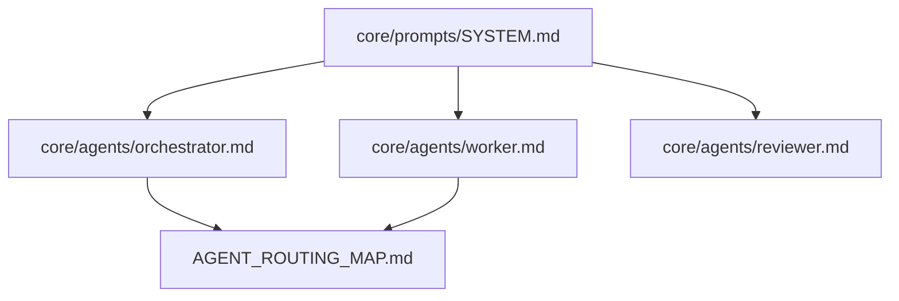

# Artifact Dependency Graph

**Status**: Specification  
**Source**: CA-007 (Incrementalist ProjectImportsFinder.cs pattern)

## Overview

The Artifact Dependency Graph tracks relationships between AGENT-33 artifacts, enabling the system to determine which artifacts are affected when a dependency changes.

## Graph Structure

### Nodes

Each artifact is a node with metadata:

```python
@dataclass
class ArtifactNode:
    """A node in the artifact dependency graph."""
    path: Path
    artifact_type: str  # framework, workflow, agent, template, research
    checksum: str  # Content hash for change detection
    dependencies: List[str]  # Paths this artifact depends on
    dependents: List[str]  # Paths that depend on this artifact
    metadata: Dict[str, Any]  # Additional properties
```

### Edges

Edges represent dependency relationships:

| Edge Type | Meaning | Example |
|-----------|---------|---------|
| `imports` | Direct reference | Template imports prompt |
| `extends` | Inheritance | Agent extends base agent |
| `uses` | Runtime dependency | Workflow uses agent |
| `contextualizes` | Provides context | Research informs template |

```python
@dataclass
class DependencyEdge:
    """An edge in the artifact dependency graph."""
    source: str  # Path of dependent
    target: str  # Path of dependency
    edge_type: str  # imports, extends, uses, contextualizes
    optional: bool = False  # If true, missing target is not an error
```

## Graph Operations

### Building the Graph

```python
def build_artifact_graph(root_path: Path) -> ArtifactGraph:
    """
    Scan repository and build dependency graph.
    
    Parses markdown files for relationship declarations:
    - YAML frontmatter with 'depends-on', 'imports', 'extends'
    - Relationship tables in markdown body
    """
    graph = ArtifactGraph()
    
    for md_file in root_path.rglob("*.md"):
        node = parse_artifact(md_file)
        graph.add_node(node)
        
        for dep in extract_dependencies(md_file):
            graph.add_edge(DependencyEdge(
                source=str(md_file),
                target=dep.target,
                edge_type=dep.type
            ))
    
    return graph
```

### Finding Affected Artifacts

Given a set of changed files, find all affected artifacts:

```python
def find_affected(
    graph: ArtifactGraph,
    changed: Set[Path]
) -> Set[Path]:
    """
    Find all artifacts affected by changes.
    
    Uses transitive closure to find all dependents.
    """
    affected = set()
    queue = list(changed)
    
    while queue:
        current = queue.pop(0)
        if current in affected:
            continue
        
        affected.add(current)
        
        # Add all artifacts that depend on this one
        node = graph.get_node(str(current))
        if node:
            for dependent in node.dependents:
                if dependent not in affected:
                    queue.append(Path(dependent))
    
    return affected
```

### Topological Sort

Process artifacts in dependency order:

```python
def topological_sort(
    graph: ArtifactGraph,
    affected: Set[Path]
) -> List[Path]:
    """
    Sort affected artifacts in processing order.
    
    Dependencies are processed before dependents.
    """
    # Filter graph to affected artifacts
    subgraph = graph.subgraph(affected)
    
    # Kahn's algorithm
    in_degree = {n: 0 for n in subgraph.nodes}
    for edge in subgraph.edges:
        in_degree[edge.target] += 1
    
    queue = [n for n, d in in_degree.items() if d == 0]
    result = []
    
    while queue:
        node = queue.pop(0)
        result.append(Path(node))
        
        for edge in subgraph.edges_from(node):
            in_degree[edge.target] -= 1
            if in_degree[edge.target] == 0:
                queue.append(edge.target)
    
    if len(result) != len(affected):
        raise CycleDetectedError("Circular dependency detected")
    
    return result
```

## Graph Persistence

### JSON Format

```json
{
  "$schema": "../schemas/artifact-graph.schema.json",
  "version": "1.0",
  "generated": "2026-01-20T15:30:00Z",
  "nodes": [
    {
      "path": "core/prompts/SYSTEM.md",
      "type": "framework",
      "checksum": "a1b2c3d4",
      "dependencies": [],
      "dependents": [
        "core/agents/orchestrator.md",
        "core/agents/worker.md"
      ]
    }
  ],
  "edges": [
    {
      "source": "core/agents/orchestrator.md",
      "target": "core/prompts/SYSTEM.md",
      "type": "imports"
    }
  ]
}
```

### Refreshing the Graph

```bash
# Rebuild entire graph
agent-33 graph build

# Update graph for changed files only
agent-33 graph update --changed-only

# Visualize as Mermaid
agent-33 graph export --format mermaid > graph.md
```

## Example: Impact Analysis

```python
# Example: What's affected if SYSTEM.md changes?

graph = load_artifact_graph()
changed = {Path("core/prompts/SYSTEM.md")}

affected = find_affected(graph, changed)
# Returns: {
#   "core/prompts/SYSTEM.md",
#   "core/agents/orchestrator.md",
#   "core/agents/worker.md",
#   "core/agents/reviewer.md",
#   ...
# }

processing_order = topological_sort(graph, affected)
# Returns: [
#   "core/prompts/SYSTEM.md",  # Process first (no deps)
#   "core/agents/orchestrator.md",  # Then dependents
#   "core/agents/worker.md",
#   ...
# ]
```

## Mermaid Visualization



## Relationships

| Type | Target | Notes |
|------|--------|-------|
| parent | `README.md` | Incremental system overview |
| depends-on | `CHANGE_DETECTION.md` | Input: changed files |
| uses | `../dependencies/DEPENDENCY_GRAPH_SPEC.md` | Graph algorithms |
| outputs-to | `../analytics/METRICS_CATALOG.md` | Graph statistics |
