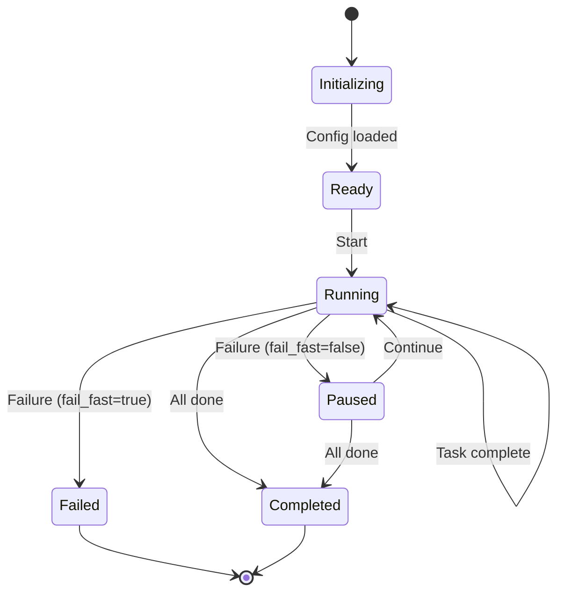

# Execution Modes Specification

**Status**: Specification  
**Source**: CA-008 (Incrementalist competitive analysis)

## Overview

AGENT-33 supports multiple execution modes for processing artifacts. The mode determines how tasks are scheduled and executed.

## Mode Definitions

### Sequential Mode

Tasks execute one at a time in dependency order.

```python
@dataclass
class SequentialMode:
    """Execute tasks one at a time."""
    name: str = "sequential"
    parallel: bool = False
    parallel_limit: int = 1
    
    async def execute(
        self, 
        tasks: List[AgentTask], 
        executor: TaskExecutor
    ) -> ExecutionResults:
        results = []
        for task in tasks:
            if self._should_stop(results):
                break
            result = await executor.run(task)
            results.append(result)
        return aggregate_results(results)
```

**Use cases**:
- Debugging execution flow
- Resource-constrained environments
- Deterministic output ordering

### Parallel Mode

Tasks execute concurrently up to the parallel limit.

```python
@dataclass
class ParallelMode:
    """Execute tasks concurrently with limit."""
    name: str = "parallel"
    parallel: bool = True
    parallel_limit: int = 4
    continue_on_error: bool = False
    fail_fast: bool = True
    
    async def execute(
        self,
        tasks: List[AgentTask],
        executor: SemaphoreExecutor
    ) -> ExecutionResults:
        return await executor.run_all(tasks)
```

**Use cases**:
- Large artifact sets
- CI/CD pipelines
- Time-sensitive processing

### Dependency-Aware Mode

Tasks execute in parallel, but respecting dependency order.

```python
@dataclass
class DependencyAwareMode:
    """Execute tasks in parallel, respecting dependencies."""
    name: str = "dependency-aware"
    parallel: bool = True
    parallel_limit: int = 4
    
    async def execute(
        self,
        tasks: List[AgentTask],
        graph: ArtifactGraph,
        executor: SemaphoreExecutor
    ) -> ExecutionResults:
        # Group tasks by dependency level
        levels = topological_levels(tasks, graph)
        
        all_results = []
        for level in levels:
            # Execute each level in parallel
            level_results = await executor.run_all(level)
            all_results.extend(level_results.all())
            
            # Stop if failures and not continue_on_error
            if level_results.failed and not self.continue_on_error:
                break
        
        return aggregate_results(all_results)
```

**Use cases**:
- Workflows with dependencies
- Cascading updates
- Ordered validation

### Dry Run Mode

Simulates execution without side effects.

```python
@dataclass
class DryRunMode:
    """Simulate execution without side effects."""
    name: str = "dry-run"
    parallel: bool = False
    
    async def execute(
        self,
        tasks: List[AgentTask],
        executor: TaskExecutor
    ) -> ExecutionResults:
        results = []
        for task in tasks:
            # Log what would happen
            print(f"[DRY RUN] Would execute: {task.name} on {task.artifact}")
            results.append(TaskResult(
                task=task,
                status="dry-run",
                duration_ms=0,
                output="Simulated success"
            ))
        return aggregate_results(results)
```

**Use cases**:
- Previewing changes
- Validating configuration
- CI/CD planning

## Mode Selection

### CLI Flags

```bash
# Sequential (default)
agent-33 run

# Parallel with limit
agent-33 run --parallel --parallel-limit 8

# Dependency-aware
agent-33 run --parallel --respect-dependencies

# Dry run
agent-33 run --dry-run
```

### Configuration File

```yaml
execution:
  mode: parallel
  parallel_limit: 4
  continue_on_error: false
  fail_fast: true
  timeout_seconds: 300
```

### Precedence

1. CLI flags (highest)
2. Environment variables
3. Configuration file
4. Defaults (lowest)

## Mode Comparison

| Mode | Parallelism | Dependencies | Side Effects | Speed |
|------|-------------|--------------|--------------|-------|
| Sequential | None | Implicit | Yes | Slow |
| Parallel | Limited | Ignored | Yes | Fast |
| Dependency-Aware | Limited | Respected | Yes | Medium |
| Dry Run | None | Logged | None | Instant |

## State Machine



## Relationships

| Type | Target | Notes |
|------|--------|-------|
| parent | `README.md` | Parallel execution overview |
| uses | `SEMAPHORE_CONTROL.md` | Concurrency control |
| depends-on | `../incremental/ARTIFACT_GRAPH.md` | Dependency ordering |
| references | `../modes/DRY_RUN_SPEC.md` | Dry run details |
