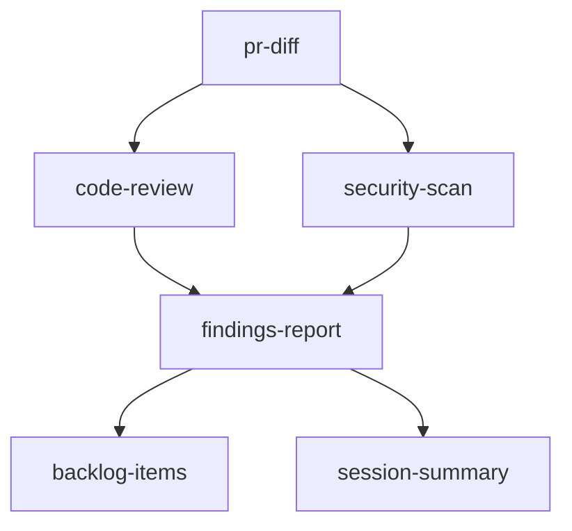
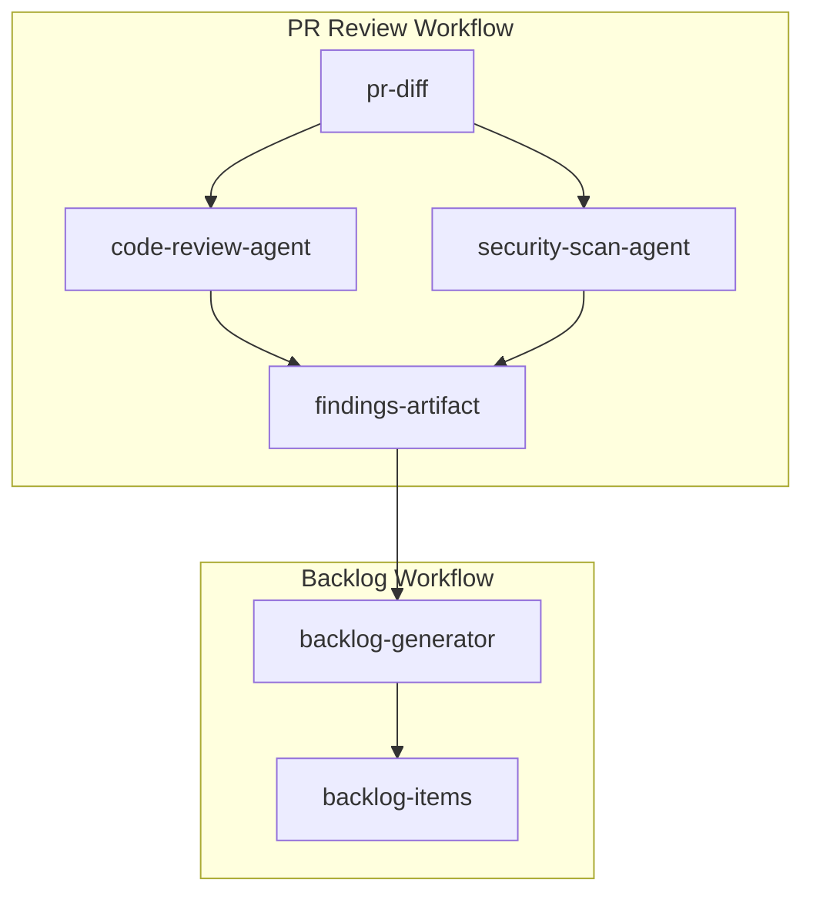

# Competitive Analysis: Dagster

**Date**: 2026-01-20  
**Repository**: https://github.com/dagster-io/dagster  
**Analyst**: AI Agent (Copilot)  
**Status**: Complete

---

## Executive Summary

Dagster is a cloud-native data pipeline orchestrator with over 12K GitHub stars, designed for the full development lifecycle. Its core philosophy centers on **asset-centric development**—treating data assets (tables, datasets, ML models) as first-class citizens with declarative definitions, automatic lineage tracking, and built-in observability. This approach provides rich capabilities for pipeline orchestration, scheduling, monitoring, and data quality enforcement.

For AGENT-33, Dagster offers significant inspiration in three key areas: (1) **declarative asset definitions** that could enhance workflow specification, (2) **multi-modal automation triggers** including schedules, sensors, and declarative conditions, and (3) **comprehensive observability** with lineage graphs, freshness policies, and health monitoring. While Dagster is Python-focused with runtime execution, many of its specification patterns translate well to AGENT-33's documentation-only, model-agnostic approach.

The analysis identifies 12 key features that would benefit AGENT-33's orchestration capabilities, with recommended adaptations ranging from asset-based workflow definitions to sophisticated freshness and staleness tracking for agentic outputs.

---

## Repository Overview

### Purpose

Dagster is a **data pipeline orchestrator** built for data engineers, featuring:
- Declarative programming model for defining data assets
- Integrated lineage and observability
- Best-in-class testability throughout development lifecycle
- Cloud-native deployment with Dagster+ (managed offering)

### Technology Stack

| Component | Technology |
|-----------|------------|
| Core Language | Python 3.9-3.14 |
| Frontend UI | React/TypeScript |
| API Layer | GraphQL |
| Documentation | Docusaurus |
| Deployment | Kubernetes (Helm), Docker, Dagster+ Cloud |
| Storage | Configurable (S3, GCS, databases) |

### Key Concepts

| Concept | Description | AGENT-33 Parallel |
|---------|-------------|-------------------|
| **Asset** | A persistent data artifact (table, file, ML model) that is computed by a function | Workflow artifact/output |
| **Op** | A discrete unit of computation (the function that computes an asset) | Task/Worker action |
| **Job** | A graph of ops that are executed together | Workflow definition |
| **Schedule** | Cron-based automation for running jobs | Scheduled triggers |
| **Sensor** | Event-driven trigger based on external conditions | Event-based triggers |
| **Resource** | External services/systems (databases, APIs) | External dependencies |
| **Partition** | Logical divisions of data (time, region, etc.) | Task segmentation |
| **Definitions** | Container for all code deployed to a Dagster instance | Workflow registry |

### Core Philosophy

1. **Asset-Centric**: Focus on *what* you want to produce, not *how* to produce it
2. **Declarative**: Define desired state; the system figures out execution
3. **Testable**: Built-in testing patterns at every layer
4. **Observable**: Automatic lineage, metadata, and health tracking
5. **Portable**: Same code runs locally and in production

---

## Feature Inventory

### Feature 1: Software-Defined Assets (SDA)

**Description**  
Assets are Python functions decorated with `@asset` that define what data to produce and its dependencies. Dependencies are inferred from function parameters.

```python
import dagster as dg

@dg.asset
def raw_orders() -> pd.DataFrame:
    return pd.read_csv("orders.csv")

@dg.asset
def cleaned_orders(raw_orders: pd.DataFrame) -> pd.DataFrame:
    return raw_orders.dropna()

@dg.asset  
def order_summary(cleaned_orders: pd.DataFrame) -> pd.DataFrame:
    return cleaned_orders.groupby("customer").sum()
```

**How It Applies to AGENT-33**  
Workflow definitions in AGENT-33 could adopt an asset-first approach where each workflow step declares its outputs (artifacts) and dependencies explicitly in the schema. This enables automatic dependency graph generation.

**Implementation Pattern**  
```yaml
# core/schemas/asset-workflow.schema.yaml
assets:
  - id: "review-findings"
    type: "document"
    producer: "reviewer-agent"
    dependencies: ["pr-diff", "code-context"]
    freshness: "session"
    
  - id: "backlog-items"
    type: "task-list"
    producer: "backlog-generator"
    dependencies: ["review-findings"]
    freshness: "on-demand"
```

**Priority**: High  
**Effort**: Medium (3-5 days)  
**Impact**: Enables declarative workflow definitions with automatic dependency resolution

---

### Feature 2: Declarative Automation

**Description**  
Automation conditions on assets that determine when they should be updated, without explicit scheduling. Conditions include: upstream data changed, time elapsed, freshness policy violated.

```python
@dg.asset(
    automation_condition=dg.AutomationCondition.on_cron("0 9 * * *")
    | dg.AutomationCondition.on_missing()
)
def daily_report():
    ...
```

**How It Applies to AGENT-33**  
AGENT-33 triggers (CA-009) could be enhanced with declarative automation conditions that specify *when* workflows should run based on asset state, not just external events.

**Implementation Pattern**  
```yaml
# core/orchestrator/triggers/DECLARATIVE_CONDITIONS.md
automation_conditions:
  - type: "freshness_violated"
    target: "review-findings"
    threshold: "24h"
    
  - type: "dependency_updated"
    target: "backlog-items"
    watch: ["review-findings"]
    
  - type: "missing"
    target: "session-summary"
    trigger_on: "session_end"
```

**Priority**: High  
**Effort**: Medium (2-3 days)  
**Impact**: Enables condition-based automation beyond simple triggers

---

### Feature 3: Asset Lineage Graphs

**Description**  
Automatic visualization of asset dependencies showing data flow through the pipeline. The UI renders an interactive DAG with status indicators.

**How It Applies to AGENT-33**  
AGENT-33's dependency graph spec (CA-014) could be enhanced to generate visual lineage diagrams for workflow artifacts, showing how documents and outputs flow through the system.

**Implementation Pattern**  
```markdown
<!-- core/orchestrator/dependencies/LINEAGE_VISUALIZATION.md -->
## Lineage Diagram Format



Lineage metadata:
- Node: artifact-id, producer-agent, last-updated
- Edge: dependency-type (required|optional), data-flow-type
```

**Priority**: Medium  
**Effort**: Low (1-2 days)  
**Impact**: Improved workflow comprehension and debugging

---

### Feature 4: Partitions and Backfills

**Description**  
Logical divisions of assets by time, category, or other dimensions. Enables running the same computation for different slices and backfilling historical data.

```python
@dg.asset(
    partitions_def=dg.DailyPartitionsDefinition(start_date="2024-01-01")
)
def daily_metrics(context):
    partition_date = context.partition_key
    return compute_metrics(partition_date)
```

**How It Applies to AGENT-33**  
Agentic workflows often need to process work in segments (by PR, by session, by repository). Partition definitions would enable structured batch processing and re-processing.

**Implementation Pattern**  
```yaml
# core/schemas/partition.schema.json
{
  "type": "object",
  "properties": {
    "partition_def": {
      "type": "string",
      "enum": ["session", "pr", "repository", "time_window"]
    },
    "partition_key": {
      "type": "string",
      "description": "Current partition identifier"
    },
    "backfill_policy": {
      "type": "string",
      "enum": ["all", "failed_only", "missing_only"]
    }
  }
}
```

**Priority**: Medium  
**Effort**: Medium (2-3 days)  
**Impact**: Enables structured batch processing and historical reprocessing

---

### Feature 5: Asset Sensors

**Description**  
Sensors that trigger runs when specific assets are materialized elsewhere. Enables reactive, event-driven workflows.

```python
@dg.asset_sensor(asset_key=dg.AssetKey("source_data"))
def process_when_source_updates(context, asset_event):
    yield dg.RunRequest(run_key=str(asset_event.materialization.metadata))
```

**How It Applies to AGENT-33**  
AGENT-33's trigger catalog could include "artifact sensors" that fire when specific documents or outputs are created/updated, enabling reactive workflow chains.

**Implementation Pattern**  
```yaml
# core/orchestrator/triggers/ARTIFACT_SENSORS.md
sensors:
  - id: "review-complete-sensor"
    watches: "review-findings"
    triggers:
      - workflow: "generate-backlog-items"
        condition: "on_create"
      - workflow: "update-analytics"
        condition: "on_update"
```

**Priority**: High  
**Effort**: Low (1-2 days)  
**Impact**: Enables reactive workflow orchestration

---

### Feature 6: Asset Freshness Policies

**Description**  
Define how "fresh" data needs to be. The system tracks when assets were last updated and alerts when freshness is violated.

```python
@dg.asset(
    freshness_policy=dg.FreshnessPolicy(maximum_lag_minutes=60)
)
def hourly_metrics():
    ...
```

**How It Applies to AGENT-33**  
Agentic outputs have freshness requirements (e.g., session summaries should be updated within the session). Freshness policies would enable staleness detection and re-execution triggers.

**Implementation Pattern**  
```yaml
# core/orchestrator/FRESHNESS_POLICY.md
freshness_policies:
  session_summary:
    maximum_lag: "session_duration"
    alert_on_violation: true
    
  backlog_items:
    maximum_lag: "7d"
    check_frequency: "daily"
    
  verification_log:
    maximum_lag: "1h"
    auto_refresh: true
```

**Priority**: High  
**Effort**: Medium (2-3 days)  
**Impact**: Ensures critical artifacts remain current

---

### Feature 7: Asset Versioning and Caching

**Description**  
Track code and data versions to enable incremental processing. Assets are only re-computed when inputs change.

```python
@dg.asset(code_version="v1.2.0")
def processed_data(raw_data):
    # Only runs if raw_data changed or code_version changed
    ...
```

**How It Applies to AGENT-33**  
AGENT-33's incremental detection (CA-007) could be enhanced with versioning semantics. Workflow outputs could track the version of prompts, schemas, and inputs used.

**Implementation Pattern**  
```yaml
# core/orchestrator/incremental/VERSIONING.md
artifact_version:
  id: "review-findings-v1.2"
  code_version: "orchestrator-v2.1.0"
  schema_version: "review-schema-v1.0"
  input_hashes:
    pr_diff: "sha256:abc123"
    prompt_template: "sha256:def456"
  computed_at: "2026-01-20T10:30:00Z"
  
cache_policy:
  hit_condition: "all_inputs_unchanged"
  ttl: "session"
```

**Priority**: Medium  
**Effort**: Medium (3-4 days)  
**Impact**: Enables efficient incremental processing

---

### Feature 8: Resource System (Dependency Injection)

**Description**  
External systems (databases, APIs, services) are defined as resources and injected into assets/ops. Enables easy swapping for testing.

```python
@dg.resource
def database_client(context):
    return DatabaseConnection(context.resource_config["url"])

@dg.asset
def user_data(database_client):
    return database_client.query("SELECT * FROM users")
```

**How It Applies to AGENT-33**  
Agentic workflows depend on external resources (LLM providers, code hosts, review systems). A resource registry would enable declarative dependency specification and testing isolation.

**Implementation Pattern**  
```yaml
# core/schemas/resource.schema.json
{
  "resources": {
    "llm_provider": {
      "type": "llm",
      "config_schema": {
        "model": "string",
        "temperature": "number"
      },
      "test_mock": "core/mocks/llm-mock.yaml"
    },
    "code_host": {
      "type": "git_provider",
      "config_schema": {
        "provider": ["github", "gitlab", "bitbucket"]
      }
    }
  }
}
```

**Priority**: Medium  
**Effort**: Medium (2-3 days)  
**Impact**: Better testability and configuration management

---

### Feature 9: Definitions Container

**Description**  
A single entry point (`Definitions`) that collects all assets, resources, jobs, schedules, and sensors for deployment.

```python
defs = dg.Definitions(
    assets=[orders, products, revenue],
    resources={"db": database_client},
    schedules=[daily_refresh],
    sensors=[new_file_sensor],
)
```

**How It Applies to AGENT-33**  
A unified "workflow manifest" that aggregates all registered workflows, agents, triggers, and resources. This would simplify deployment and validation.

**Implementation Pattern**  
```yaml
# core/schemas/definitions.schema.yaml
definitions:
  version: "1.0"
  
  agents:
    - $ref: "core/orchestrator/agents/*.yaml"
    
  workflows:
    - $ref: "core/workflows/**/*.yaml"
    
  triggers:
    - $ref: "core/orchestrator/triggers/*.yaml"
    
  resources:
    - $ref: "core/orchestrator/resources/*.yaml"
    
  validation:
    on_load: ["schema_check", "dependency_resolution"]
```

**Priority**: Medium  
**Effort**: Low (1-2 days)  
**Impact**: Unified entry point for orchestration

---

### Feature 10: IO Managers

**Description**  
Abstraction for reading and writing asset data. Separates compute logic from storage concerns.

```python
class ParquetIOManager(dg.IOManager):
    def load_input(self, context):
        return pd.read_parquet(self._get_path(context))
    
    def handle_output(self, context, obj):
        obj.to_parquet(self._get_path(context))
```

**How It Applies to AGENT-33**  
Agentic workflows produce various artifacts (markdown, JSON, YAML). An IO manager abstraction would standardize artifact persistence and retrieval.

**Implementation Pattern**  
```yaml
# core/orchestrator/io/README.md
io_managers:
  markdown:
    load: "read_file_as_text"
    save: "write_with_frontmatter"
    path_template: "{workflow}/{artifact_id}.md"
    
  json_schema:
    load: "parse_and_validate_json"
    save: "serialize_with_schema_ref"
    path_template: "{workflow}/{artifact_id}.json"
    
  trace_log:
    load: "parse_trace_entries"
    save: "append_structured_log"
    path_template: "logs/{session}/{trace_id}.jsonl"
```

**Priority**: Low  
**Effort**: Medium (2-3 days)  
**Impact**: Standardized artifact persistence

---

### Feature 11: Asset Health Status

**Description**  
Real-time indicators showing asset health: successful/failed materializations, freshness violations, data quality check results.

**How It Applies to AGENT-33**  
Workflow health dashboards showing: last successful run, pending triggers, freshness status, and error counts per workflow/agent.

**Implementation Pattern**  
```yaml
# core/orchestrator/analytics/HEALTH_STATUS.md
health_indicators:
  - workflow_id: "pr-review"
    status: "healthy"
    last_run: "2026-01-20T10:00:00Z"
    freshness: "current"
    error_count_24h: 0
    
  - workflow_id: "backlog-generator"
    status: "warning"
    last_run: "2026-01-19T08:00:00Z"
    freshness: "stale"
    error_count_24h: 2
    warnings:
      - "Freshness policy violated (>24h)"
```

**Priority**: Medium  
**Effort**: Low (1-2 days)  
**Impact**: Operational visibility and alerting

---

### Feature 12: Testing Framework

**Description**  
Built-in patterns for testing assets at multiple levels: unit tests (single asset), integration tests (asset graphs), and end-to-end tests.

```python
def test_cleaned_orders():
    raw = pd.DataFrame({"a": [1, None, 3]})
    result = cleaned_orders(raw)
    assert result.isna().sum().sum() == 0

def test_full_pipeline():
    result = dg.materialize([raw_orders, cleaned_orders, order_summary])
    assert result.success
```

**How It Applies to AGENT-33**  
AGENT-33's test matrix could be enhanced with patterns for testing workflows: mock inputs, expected outputs, and integration scenarios.

**Implementation Pattern**  
```yaml
# core/orchestrator/test/WORKFLOW_TESTING.md
test_patterns:
  unit:
    description: "Test single agent with mock inputs"
    setup:
      - load: "mock_inputs/{workflow}/{test_case}.yaml"
      - configure: "resources.llm = mock_llm"
    assert:
      - output_matches: "expected/{workflow}/{test_case}.yaml"
      
  integration:
    description: "Test agent chain end-to-end"
    setup:
      - trigger: "pr-review-workflow"
      - inputs: "test_fixtures/sample_pr.yaml"
    assert:
      - artifacts_created: ["findings", "backlog", "summary"]
      - no_errors: true
```

**Priority**: High  
**Effort**: Medium (3-4 days)  
**Impact**: Quality assurance for agentic workflows

---

## Recommendations

### Recommendation 1: Adopt Asset-First Workflow Definitions

**Description**  
Refactor workflow schemas to define outputs (artifacts) as first-class assets with explicit dependencies, enabling automatic graph generation and execution ordering.

**Implementation Pattern**
```yaml
# New: core/schemas/asset-workflow.schema.json
{
  "$schema": "http://json-schema.org/draft-07/schema#",
  "type": "object",
  "properties": {
    "assets": {
      "type": "array",
      "items": {
        "type": "object",
        "properties": {
          "id": { "type": "string" },
          "producer": { "$ref": "#/definitions/agent_ref" },
          "dependencies": { "type": "array", "items": { "type": "string" } },
          "freshness_policy": { "$ref": "#/definitions/freshness" },
          "partition_def": { "$ref": "#/definitions/partition" }
        },
        "required": ["id", "producer"]
      }
    }
  }
}
```

**Priority**: High  
**Effort**: 3-5 days

---

### Recommendation 2: Implement Freshness Tracking

**Description**  
Add freshness policies to artifacts with automatic staleness detection and alerting. Critical for agentic workflows where output currency matters.

**Implementation Pattern**
```markdown
<!-- core/orchestrator/FRESHNESS_TRACKING.md -->
## Freshness Tracking Specification

### Freshness Levels
- `realtime`: Must be current (<1 minute)
- `session`: Valid within current session
- `daily`: Updated within 24 hours
- `weekly`: Updated within 7 days
- `manual`: Updated on explicit trigger only

### Staleness Detection
```json
{
  "artifact_id": "session-summary",
  "last_updated": "2026-01-20T08:00:00Z",
  "freshness_policy": "session",
  "current_session": "session-20260120-001",
  "is_stale": true,
  "stale_reason": "session_changed"
}
```
```

**Priority**: High  
**Effort**: 2-3 days

---

### Recommendation 3: Add Artifact Sensors

**Description**  
Extend trigger catalog with artifact-based sensors that fire when specific outputs are created or modified.

**Implementation Pattern**
```yaml
# core/orchestrator/triggers/ARTIFACT_SENSOR_SPEC.md
artifact_sensors:
  - sensor_id: "review-complete"
    watch_artifact: "review-findings"
    watch_events: ["create", "update"]
    triggers:
      - workflow: "generate-backlog"
        pass_artifact: true
      - workflow: "notify-stakeholders"
        condition: "severity >= HIGH"
```

**Priority**: High  
**Effort**: 1-2 days

---

### Recommendation 4: Create Workflow Definitions Container

**Description**  
Single manifest file that aggregates all workflows, agents, triggers, and resources for validation and deployment.

**Implementation Pattern**
```yaml
# core/DEFINITIONS.yaml
version: "1.0"
name: "agent-33-orchestration"

includes:
  agents: "core/orchestrator/agents/AGENT_REGISTRY.md"
  workflows: "core/workflows/**/*.yaml"
  triggers: "core/orchestrator/triggers/TRIGGER_CATALOG.md"
  schemas: "core/schemas/*.schema.json"

validation:
  - check: "all_dependencies_resolvable"
  - check: "no_circular_dependencies"
  - check: "all_agents_registered"
```

**Priority**: Medium  
**Effort**: 1-2 days

---

### Recommendation 5: Enhance Dependency Graph Visualization

**Description**  
Add lineage visualization capabilities to dependency graph spec, generating Mermaid diagrams from workflow definitions.

**Implementation Pattern**
```markdown
<!-- core/orchestrator/dependencies/VISUALIZATION_SPEC.md -->
## Automatic Lineage Generation

Input: Workflow YAML with asset definitions
Output: Mermaid diagram + interactive HTML

### Example Output

```

**Priority**: Medium  
**Effort**: 2-3 days

---

### Recommendation 6: Add Partition Support

**Description**  
Enable partitioned workflow execution for batch processing by PR, session, or repository.

**Implementation Pattern**
```yaml
# core/schemas/partition.schema.json
{
  "partition_types": {
    "session": {
      "key_format": "session-{date}-{seq}",
      "backfill": "last_n:10"
    },
    "pull_request": {
      "key_format": "pr-{repo}-{number}",
      "backfill": "open_only"
    },
    "repository": {
      "key_format": "repo-{org}-{name}",
      "backfill": "all"
    }
  }
}
```

**Priority**: Medium  
**Effort**: 2-3 days

---

### Recommendation 7: Implement Workflow Testing Patterns

**Description**  
Define standard testing patterns for agentic workflows including mocks, fixtures, and assertions.

**Implementation Pattern**
```yaml
# core/orchestrator/test/TESTING_FRAMEWORK.md
testing_patterns:
  
  unit_test:
    description: "Test single agent with controlled inputs"
    structure:
      inputs: "test/fixtures/{agent}/inputs/*.yaml"
      expected: "test/fixtures/{agent}/expected/*.yaml"
      mocks:
        llm: "test/mocks/llm-deterministic.yaml"
        
  integration_test:
    description: "Test workflow end-to-end"
    structure:
      scenario: "test/scenarios/{workflow}/*.yaml"
      assertions:
        - artifacts_exist
        - schema_valid
        - no_error_traces
```

**Priority**: High  
**Effort**: 3-4 days

---

### Recommendation 8: Add Resource Registry

**Description**  
Formalize external dependencies (LLM providers, code hosts) as resources with schemas and mock configurations.

**Implementation Pattern**
```yaml
# core/orchestrator/resources/RESOURCE_REGISTRY.md
resources:
  llm_provider:
    schema:
      model: { type: string, required: true }
      temperature: { type: number, default: 0.7 }
      max_tokens: { type: integer, default: 4096 }
    providers:
      - openai
      - anthropic
      - local
    mock: "test/mocks/llm.yaml"
    
  code_host:
    schema:
      provider: { type: string, enum: [github, gitlab, bitbucket] }
      token_env: { type: string }
    mock: "test/mocks/git.yaml"
```

**Priority**: Medium  
**Effort**: 2-3 days

---

## Backlog Items Generated

| ID | Title | Priority | Effort | Impact |
|----|-------|----------|--------|--------|
| CA-020 | Asset-First Workflow Schema | High | 4 days | Declarative workflow definitions with dependency resolution |
| CA-021 | Freshness Policy Tracking | High | 3 days | Staleness detection for agentic artifacts |
| CA-022 | Artifact Sensor Triggers | High | 2 days | Reactive workflow chaining on artifact events |
| CA-023 | Workflow Testing Framework | High | 4 days | Quality assurance patterns for agentic workflows |
| CA-024 | Definitions Container Manifest | Medium | 2 days | Unified entry point for orchestration validation |
| CA-025 | Lineage Visualization Generator | Medium | 3 days | Automatic Mermaid diagrams from workflow specs |
| CA-026 | Partition Definitions Schema | Medium | 3 days | Structured batch processing by PR/session/repo |
| CA-027 | Resource Registry Schema | Medium | 3 days | Formalized external dependencies with mocks |
| CA-028 | Asset Versioning Spec | Medium | 3 days | Version tracking for incremental processing |
| CA-029 | Workflow Health Dashboard Spec | Medium | 2 days | Operational visibility and health indicators |
| CA-030 | IO Manager Abstraction | Low | 3 days | Standardized artifact persistence patterns |
| CA-031 | Declarative Automation Conditions | Medium | 3 days | Condition-based automation beyond triggers |

---

## Summary Matrix

| Capability | Dagster | AGENT-33 Current | Gap | Recommendation |
|------------|---------|------------------|-----|----------------|
| **Asset Definitions** | Python decorators with type inference | YAML workflow specs | Medium | CA-020: Add asset-first schema |
| **Dependency Graphs** | Automatic from code | Manual in DEPENDENCY_GRAPH_SPEC | Low | CA-025: Auto-generate from specs |
| **Automation Triggers** | Schedules, sensors, conditions | Trigger catalog (CA-009) | Low | CA-022, CA-031: Add sensors + conditions |
| **Freshness Tracking** | Built-in policies + alerts | Not present | High | CA-021: Implement freshness policies |
| **Partitioning** | Native time/dimension partitions | Not present | Medium | CA-026: Add partition definitions |
| **Versioning/Caching** | Code + data versions | Basic change detection (CA-007) | Medium | CA-028: Enhance with versioning |
| **Testing Framework** | Multi-level patterns | Basic test matrix | Medium | CA-023: Comprehensive patterns |
| **Resource Management** | Dependency injection | Ad-hoc references | Medium | CA-027: Resource registry |
| **Observability** | UI + health status + insights | Analytics catalog (CA-015) | Low | CA-029: Health dashboard spec |
| **Unified Manifest** | Definitions container | Multiple index files | Low | CA-024: Single definitions file |
| **IO Abstraction** | IOManager classes | Document templates | Low | CA-030: IO manager patterns |
| **Lineage Visualization** | Interactive web UI | Mermaid in docs | Low | CA-025: Generator from specs |

### Key Differentiators

| Aspect | Dagster Strength | AGENT-33 Strength |
|--------|------------------|-------------------|
| **Paradigm** | Runtime execution engine | Documentation-first specifications |
| **Language** | Python-native | Model/tool-agnostic |
| **Deployment** | Cloud/Kubernetes | Repo-embedded guidance |
| **Testing** | Execute and verify | Schema validation + evidence |
| **Observability** | Real-time UI | Audit logs + traces |

### Adoption Strategy

1. **Phase 1 (High Priority)**: CA-020, CA-021, CA-022, CA-023 - Core asset patterns
2. **Phase 2 (Medium Priority)**: CA-024, CA-025, CA-026, CA-027 - Infrastructure enhancements  
3. **Phase 3 (Lower Priority)**: CA-028, CA-029, CA-030, CA-031 - Polish and advanced features

---

## References

1. [Dagster GitHub Repository](https://github.com/dagster-io/dagster)
2. [Dagster Documentation](https://docs.dagster.io)
3. [AGENT-33 Orchestration Index](../../core/ORCHESTRATION_INDEX.md)
4. [AGENT-33 Trigger Catalog](../../core/orchestrator/triggers/TRIGGER_CATALOG.md)
5. [AGENT-33 Dependency Graph Spec](../../core/orchestrator/dependencies/DEPENDENCY_GRAPH_SPEC.md)

---

**Analysis Complete**: 2026-01-20  
**Next Steps**: Prioritize backlog items CA-020 through CA-023 for next development cycle
