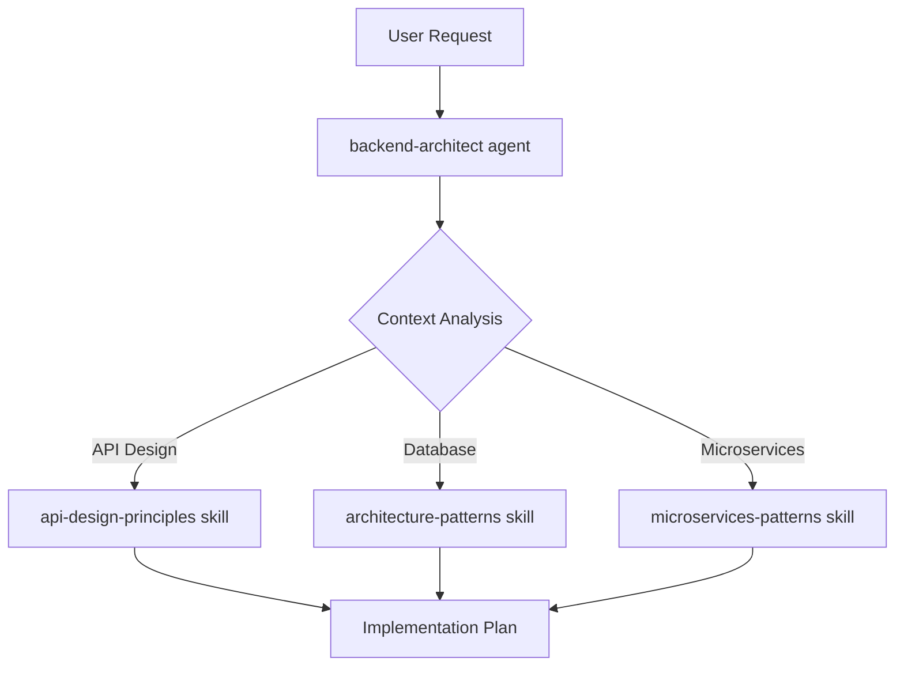

# Competitive Analysis: wshobson/agents
**Date**: 2026-01-20  
**Repository**: https://github.com/wshobson/agents  
**Status**: Complete  
**Analyst**: AGENT-33 Competitive Intelligence  

---

## Executive Summary

The **wshobson/agents** repository represents a production-ready Claude Code plugin ecosystem featuring 72 focused plugins, 108 specialized agents, 129 agent skills, and 72 development tools. It implements a granular, composable architecture optimized for minimal token usage and progressive disclosure—closely aligning with AGENT-33's model-agnostic, evidence-first principles.

Key differentiators include: (1) a three-tier model strategy (Opus/Sonnet/Haiku) for cost-optimized orchestration, (2) a comprehensive skill specification following Anthropic's progressive disclosure architecture, and (3) the "Conductor" plugin implementing Context-Driven Development with structured specifications, phased plans, and semantic git reversion. The repository demonstrates mature patterns for agent specialization, workflow orchestration, and token-efficient context management.

For AGENT-33, this analysis identifies 12 high-value features that would enhance orchestration capabilities, documentation standards, and agent coordination patterns. The most impactful opportunities are: tiered model assignment specifications, progressive disclosure skill architecture, agent-skill integration patterns, workflow orchestration templates, and the Conductor-style track management methodology.

---

## Repository Overview

### Purpose

wshobson/agents provides a comprehensive marketplace of Claude Code plugins enabling:
- **Multi-agent orchestration** across 23 domain categories
- **Progressive knowledge disclosure** via 129 specialized skills
- **Workflow automation** through pre-configured orchestrator commands
- **Token-efficient context management** via granular plugin architecture

### Technology Stack

| Component | Technology |
|-----------|------------|
| Platform | Claude Code (Anthropic) |
| Plugin Format | `.claude-plugin/marketplace.json` |
| Agent Definitions | Markdown with YAML frontmatter |
| Skills | Anthropic Agent Skills Specification |
| Commands | Slash command interface |
| Version | 1.3.7 |

### Key Concepts

1. **Plugin Isolation**: Each plugin loads only its specific agents, commands, and skills (~300 tokens average vs. full marketplace)

2. **Single Responsibility**: Average 3.4 components per plugin following Unix philosophy

3. **Progressive Disclosure**: Three-tier skill architecture:
   - Metadata (always loaded)
   - Instructions (loaded on activation)
   - Resources (loaded on demand)

4. **Model Tiering**: Strategic assignment across Opus (42), Sonnet (39), Haiku (18) for cost/capability optimization

5. **Composable Workflows**: Multi-agent orchestrators coordinate focused plugins

---

## Feature Inventory

### Feature 1: Three-Tier Model Assignment Strategy

**Description**: Strategic model assignment (Opus/Sonnet/Haiku) based on task complexity, with "inherit" option for user control. Critical tasks (security, architecture, code review) use Opus; complex reasoning uses Sonnet; fast operational tasks use Haiku.

**How it applies to AGENT-33**: AGENT-33's model-agnostic principle could benefit from specifying *recommended* model tiers in agent definitions while remaining implementation-agnostic. This enables cost optimization documentation for downstream implementations.

**Implementation Pattern**:
```yaml
# core/agents/security-auditor.yml
name: security-auditor
description: Vulnerability assessment and OWASP compliance
model_tier: premium  # Maps to: opus/o1/gemini-ultra depending on provider
tier_rationale: |
  Security auditing requires highest reasoning capability.
  80.9% SWE-bench accuracy justifies premium tier cost.
fallback_tier: standard
```

**Priority**: High  
**Effort**: Small (1-2 days)  
**Impact**: High - Enables cost-optimized implementations

---

### Feature 2: Progressive Disclosure Skill Architecture

**Description**: Skills use a three-tier loading strategy: metadata (always), instructions (on activation), resources (on demand). Activation triggers via "Use when" clauses enable automatic skill invocation.

**How it applies to AGENT-33**: AGENT-33's documentation-first approach could define skill specifications that implementations can reference. This aligns with minimal diffs and evidence-first principles.

**Implementation Pattern**:
```yaml
# core/skills/schema.yml
type: object
required: [name, description, activation]
properties:
  name:
    type: string
    pattern: "^[a-z][a-z0-9-]*$"
  description:
    type: string
    maxLength: 1024
  activation:
    type: object
    properties:
      triggers:
        type: array
        items:
          type: string
          description: "Use when" clause patterns
      context_required:
        type: array
        description: Required context keys for activation
  disclosure:
    type: object
    properties:
      level_1_metadata:
        type: string
        description: Always-loaded (< 50 tokens)
      level_2_instructions:
        type: string
        description: Loaded on activation (< 500 tokens)
      level_3_resources:
        type: string
        description: Loaded on demand (unlimited)
```

**Priority**: High  
**Effort**: Medium (3-5 days)  
**Impact**: High - Token efficiency for all implementations

---

### Feature 3: Agent Skill Integration Pattern

**Description**: Clear separation where agents provide reasoning/orchestration while skills provide specialized knowledge. Agents invoke skills automatically based on context.

**How it applies to AGENT-33**: Defines a clear agent→skill dependency model that can be documented in AGENT-33's workflow specifications.

**Implementation Pattern**:
```yaml
# core/workflows/agent-skill-binding.md

## Agent-Skill Integration

### Pattern: Declarative Skill Dependencies
Agents declare skill affinities; runtime activates skills based on context.

### Example: Backend Feature Development


### Binding Specification
```yaml
agent: backend-architect
skill_affinities:
  - skill: api-design-principles
    weight: 0.9
    context_match: ["REST", "GraphQL", "API"]
  - skill: architecture-patterns
    weight: 0.8
    context_match: ["clean architecture", "DDD", "hexagonal"]
```
```

**Priority**: High  
**Effort**: Medium (3-5 days)  
**Impact**: High - Clear orchestration semantics

---

### Feature 4: Workflow Orchestrator Templates

**Description**: Pre-configured multi-agent workflows for common operations (full-stack development, security hardening, incident response, ML pipelines) with explicit agent sequencing.

**How it applies to AGENT-33**: Aligns with existing workflow documentation. Could extend with orchestrator templates showing agent coordination patterns.

**Implementation Pattern**:
```yaml
# core/orchestrator/templates/full-stack-feature.yml
name: full-stack-feature
description: End-to-end feature implementation
trigger: "/orchestrate:full-stack-feature {description}"

phases:
  - name: design
    parallel: false
    steps:
      - agent: backend-architect
        output: api-spec.yml
        skills: [api-design-principles]
      - agent: database-architect
        output: schema.sql
        depends_on: [backend-architect]
        
  - name: implementation
    parallel: true
    steps:
      - agent: backend-developer
        input: api-spec.yml
        skills: [fastapi-templates]
      - agent: frontend-developer
        input: api-spec.yml
        skills: [react-state-management]
        
  - name: validation
    parallel: false
    steps:
      - agent: test-automator
        depends_on: [backend-developer, frontend-developer]
      - agent: security-auditor
        depends_on: [test-automator]
        
  - name: deployment
    steps:
      - agent: deployment-engineer
        skills: [github-actions-templates]
      - agent: observability-engineer
        skills: [prometheus-configuration]
```

**Priority**: High  
**Effort**: Medium (4-6 days)  
**Impact**: High - Reusable orchestration patterns

---

### Feature 5: Conductor Track Management System

**Description**: Context-Driven Development methodology with tracks (work units), specifications, phased plans, and semantic git reversion. Maintains product context, tech stack preferences, and workflow documentation.

**How it applies to AGENT-33**: Highly relevant to AGENT-33's phased development approach. Could adopt track management patterns for orchestrated work units.

**Implementation Pattern**:
```yaml
# core/templates/track-structure/
tracks/
├── {track-id}/
│   ├── spec.md           # Requirements specification
│   ├── plan.md           # Phased task breakdown
│   ├── metadata.json     # Track state and history
│   └── artifacts/        # Generated outputs

# Track Metadata Schema
{
  "id": "AUTH-001",
  "type": "feature|bug|chore|refactor",
  "status": "spec|planned|in-progress|review|complete|archived",
  "created": "2026-01-20T10:00:00Z",
  "phases": [
    {
      "name": "Phase 1: Core Auth",
      "tasks": [
        {"id": "T1", "status": "complete", "commits": ["abc123"]},
        {"id": "T2", "status": "in-progress", "commits": []}
      ]
    }
  ],
  "revert_points": ["abc123", "def456"]
}
```

**Priority**: Medium  
**Effort**: Large (5-8 days)  
**Impact**: High - Structured work management

---

### Feature 6: Granular Plugin Architecture Specification

**Description**: 2-8 components per plugin guideline following Anthropic's recommendations. Clear plugin boundaries with agents/, commands/, and skills/ directories.

**How it applies to AGENT-33**: AGENT-33's packs/ concept could adopt standardized structure specifications for implementations.

**Implementation Pattern**:
```yaml
# core/schemas/pack-structure.schema.json
{
  "$schema": "https://json-schema.org/draft/2020-12/schema",
  "type": "object",
  "properties": {
    "pack": {
      "type": "object",
      "properties": {
        "name": {"type": "string"},
        "version": {"type": "string"},
        "description": {"type": "string", "maxLength": 100},
        "components": {
          "type": "object",
          "properties": {
            "agents": {
              "type": "array",
              "minItems": 0,
              "maxItems": 6
            },
            "workflows": {
              "type": "array",
              "minItems": 0,
              "maxItems": 4
            },
            "skills": {
              "type": "array",
              "minItems": 0,
              "maxItems": 8
            }
          }
        }
      },
      "additionalProperties": false
    }
  }
}
```

**Priority**: Medium  
**Effort**: Small (1-2 days)  
**Impact**: Medium - Standardization

---

### Feature 7: C4 Architecture Documentation Workflow

**Description**: Four-level C4 documentation generation: Code → Component → Container → Context. Uses agent orchestration with specialized C4 agents at each level.

**How it applies to AGENT-33**: Could document C4 as a standard architecture documentation workflow in core/workflows/.

**Implementation Pattern**:
```markdown
# core/workflows/c4-architecture.md

## C4 Architecture Documentation Workflow

### Orchestration Pattern
```yaml
workflow: c4-documentation
direction: bottom-up  # Code → Component → Container → Context

agents:
  - name: c4-code
    tier: fast
    output: C4-Documentation/{module}/code.md
    
  - name: c4-component
    tier: standard
    input: all c4-code outputs
    output: C4-Documentation/component.md
    
  - name: c4-container
    tier: standard
    input: component.md
    output: C4-Documentation/container.md
    includes: [OpenAPI specs, deployment configs]
    
  - name: c4-context
    tier: standard
    input: container.md
    output: C4-Documentation/context.md
    includes: [personas, user journeys, external systems]
```

### Mermaid Integration
Each level generates Mermaid diagrams in standard C4 notation.
```

**Priority**: Medium  
**Effort**: Medium (3-4 days)  
**Impact**: Medium - Documentation standards

---

### Feature 8: Hybrid Orchestration Patterns

**Description**: Documented patterns for combining model tiers: Planning→Execution→Review, Reasoning→Action, Complex→Simple cascades.

**How it applies to AGENT-33**: AGENT-33's orchestration documentation could include these as standard patterns with model-agnostic tier references.

**Implementation Pattern**:
```yaml
# core/orchestrator/patterns/hybrid-orchestration.yml

patterns:
  - name: planning-execution-review
    description: Premium model plans, fast model executes, standard reviews
    sequence:
      - phase: planning
        tier: premium
        agents: [backend-architect, database-architect]
      - phase: execution
        tier: fast
        agents: [code-generator, test-generator]
      - phase: review
        tier: standard
        agents: [code-reviewer, security-auditor]
        
  - name: incident-response-cascade
    description: Premium diagnoses, fast remediates
    sequence:
      - phase: diagnosis
        tier: premium
        agents: [incident-responder]
      - phase: remediation
        tier: fast
        parallel: true
        agents: [devops-troubleshooter, deployment-engineer]
      - phase: verification
        tier: standard
        agents: [observability-engineer]
```

**Priority**: Medium  
**Effort**: Small (2-3 days)  
**Impact**: High - Cost optimization patterns

---

### Feature 9: Agent Frontmatter Specification

**Description**: Standardized YAML frontmatter for agent definitions including name, description, model, triggers, and activation criteria.

**How it applies to AGENT-33**: Extends existing agent specification in core/agents/ with richer metadata.

**Implementation Pattern**:
```yaml
# core/schemas/agent-frontmatter.schema.json
{
  "type": "object",
  "required": ["name", "description", "tier"],
  "properties": {
    "name": {
      "type": "string",
      "pattern": "^[a-z][a-z0-9-]*$"
    },
    "description": {
      "type": "string",
      "maxLength": 200
    },
    "tier": {
      "enum": ["premium", "standard", "fast", "inherit"]
    },
    "tier_rationale": {
      "type": "string"
    },
    "domain": {
      "type": "string",
      "enum": ["architecture", "security", "operations", "development", "data", "documentation"]
    },
    "skills": {
      "type": "array",
      "items": {"type": "string"}
    },
    "invocation": {
      "type": "object",
      "properties": {
        "natural_language": {"type": "array", "items": {"type": "string"}},
        "commands": {"type": "array", "items": {"type": "string"}}
      }
    }
  }
}
```

**Priority**: Medium  
**Effort**: Small (1-2 days)  
**Impact**: Medium - Standardization

---

### Feature 10: Context Persistence and Restoration

**Description**: Commands for saving and restoring conversation context across sessions, enabling resumable workflows.

**How it applies to AGENT-33**: Could be documented as a standard pattern for long-running orchestrations.

**Implementation Pattern**:
```yaml
# core/templates/context-management.md

## Context Persistence Pattern

### State Capture
```json
{
  "session_id": "uuid",
  "created": "ISO8601",
  "workflow": "full-stack-feature",
  "current_phase": 2,
  "current_step": 3,
  "artifacts": {
    "api-spec.yml": "sha256:...",
    "schema.sql": "sha256:..."
  },
  "decisions": [
    {"timestamp": "...", "decision": "Use PostgreSQL", "rationale": "ACID compliance"}
  ],
  "pending_actions": [
    {"agent": "frontend-developer", "input": "api-spec.yml"}
  ]
}
```

### Restoration Protocol
1. Validate artifact integrity via checksums
2. Replay decision log for context reconstruction
3. Resume from pending_actions
```

**Priority**: Low  
**Effort**: Medium (3-4 days)  
**Impact**: Medium - Session continuity

---

### Feature 11: Slash Command Namespacing

**Description**: Plugin-namespaced commands (`/plugin-name:command-name`) for clear invocation and discoverability.

**How it applies to AGENT-33**: Could adopt as a command specification pattern for implementations.

**Implementation Pattern**:
```yaml
# core/schemas/command-definition.schema.yml
type: object
required: [namespace, name, description, handler]
properties:
  namespace:
    type: string
    description: Plugin/pack identifier
  name:
    type: string
    description: Command name (hyphen-case)
  full_name:
    type: string
    description: "Generated: {namespace}:{name}"
  description:
    type: string
  arguments:
    type: array
    items:
      type: object
      properties:
        name: {type: string}
        type: {enum: [string, number, boolean, file]}
        required: {type: boolean}
        default: {}
  handler:
    type: object
    properties:
      agent: {type: string}
      workflow: {type: string}
      skills: {type: array}
```

**Priority**: Low  
**Effort**: Small (1-2 days)  
**Impact**: Low - Implementation detail

---

### Feature 12: TDD Workflow Integration

**Description**: Built-in TDD red-green-refactor cycle commands with verification checkpoints and documentation sync.

**How it applies to AGENT-33**: Could document TDD as a standard development workflow pattern.

**Implementation Pattern**:
```yaml
# core/workflows/tdd-cycle.yml
name: tdd-workflow
description: Test-Driven Development with verification

phases:
  - name: red
    description: Write failing tests first
    agent: test-automator
    verification:
      - "Tests must fail with expected error"
      - "Test names describe behavior"
    checkpoint: manual  # Require human confirmation
    
  - name: green
    description: Minimal implementation to pass
    agent: code-generator
    verification:
      - "All new tests pass"
      - "No regression in existing tests"
    checkpoint: automated
    
  - name: refactor
    description: Improve code quality
    agent: code-reviewer
    constraints:
      - "Tests must remain passing"
      - "No functional changes"
    verification:
      - "Code quality metrics improved"
      - "All tests still pass"
    checkpoint: automated

hooks:
  on_phase_complete:
    - update_task_status
    - sync_documentation
  on_cycle_complete:
    - commit_with_message
    - update_track_progress
```

**Priority**: Low  
**Effort**: Small (2-3 days)  
**Impact**: Medium - Development methodology

---

## Recommendations

### Recommendation 1: Adopt Tiered Model Specification
**Priority**: High | **Effort**: Small

Extend AGENT-33's agent schemas to include model tier recommendations while maintaining model-agnostic principles.

```yaml
# Add to core/schemas/agent.schema.yml
tier:
  type: string
  enum: [premium, standard, fast, inherit]
  description: |
    Model capability tier recommendation:
    - premium: Highest capability (Claude Opus, GPT-4, Gemini Ultra)
    - standard: Balanced (Claude Sonnet, GPT-4-turbo)
    - fast: Speed optimized (Claude Haiku, GPT-3.5-turbo)
    - inherit: Use session default
```

### Recommendation 2: Implement Progressive Disclosure Skills
**Priority**: High | **Effort**: Medium

Create skill specification following Anthropic's three-tier architecture in `core/skills/`.

```
core/skills/
├── schema.yml              # Skill validation schema
├── activation-patterns.md  # Trigger documentation
├── templates/
│   └── skill-template.md   # Boilerplate for new skills
└── registry.yml            # Skill catalog
```

### Recommendation 3: Add Workflow Orchestrator Templates
**Priority**: High | **Effort**: Medium

Extend `core/orchestrator/` with pre-built multi-agent workflow templates.

```
core/orchestrator/
├── templates/
│   ├── full-stack-feature.yml
│   ├── security-hardening.yml
│   ├── incident-response.yml
│   └── documentation-generation.yml
└── patterns/
    ├── hybrid-orchestration.md
    └── agent-skill-binding.md
```

### Recommendation 4: Create Track Management Specification
**Priority**: Medium | **Effort**: Large

Adopt Conductor's track-based work management for structured orchestration.

```yaml
# core/templates/track-management/
├── track.schema.json
├── spec-template.md
├── plan-template.md
└── lifecycle.md  # Status transitions
```

### Recommendation 5: Document C4 Architecture Workflow
**Priority**: Medium | **Effort**: Medium

Add C4 documentation generation as a standard architecture workflow.

```
core/workflows/
└── c4-architecture/
    ├── README.md
    ├── orchestration.yml
    └── templates/
        ├── code-level.md
        ├── component-level.md
        ├── container-level.md
        └── context-level.md
```

### Recommendation 6: Extend Agent Frontmatter Schema
**Priority**: Medium | **Effort**: Small

Enhance existing agent definitions with richer metadata for tooling and discovery.

### Recommendation 7: Add Hybrid Orchestration Patterns
**Priority**: Medium | **Effort**: Small

Document cost-optimization patterns for multi-tier agent coordination.

### Recommendation 8: Create Pack Structure Specification
**Priority**: Low | **Effort**: Small

Formalize pack composition guidelines (2-8 components) aligned with wshobson's granular architecture.

---

## Backlog Items Generated

| ID | Title | Priority | Effort | Impact |
|----|-------|----------|--------|--------|
| CA-001 | Add model tier specification to agent schema | High | Small | High |
| CA-002 | Create progressive disclosure skill specification | High | Medium | High |
| CA-003 | Document agent-skill binding patterns | High | Medium | High |
| CA-004 | Add workflow orchestrator templates | High | Medium | High |
| CA-005 | Implement track management specification | Medium | Large | High |
| CA-006 | Add hybrid orchestration pattern documentation | Medium | Small | High |
| CA-007 | Create C4 architecture workflow specification | Medium | Medium | Medium |
| CA-008 | Extend agent frontmatter schema | Medium | Small | Medium |
| CA-009 | Formalize pack structure specification | Medium | Small | Medium |
| CA-010 | Add context persistence pattern documentation | Low | Medium | Medium |
| CA-011 | Document slash command namespacing specification | Low | Small | Low |
| CA-012 | Add TDD workflow integration pattern | Low | Small | Medium |

---

## Summary Matrix

| Aspect | wshobson/agents | AGENT-33 | Gap Analysis |
|--------|-----------------|----------|--------------|
| **Philosophy** | Claude-specific, plugin-based | Model-agnostic, specification-based | Complementary - AGENT-33 can document patterns implementation-agnostically |
| **Agent Count** | 108 specialized agents | Flexible specification | Add tier recommendations |
| **Skills** | 129 with progressive disclosure | Not yet specified | Opportunity: skill specification |
| **Workflows** | 15 orchestrators, 72 tools | Workflow documentation exists | Extend with orchestrator templates |
| **Token Efficiency** | Core design principle | Implicit | Document explicitly |
| **Structure** | agents/, commands/, skills/ | agents/, workflows/, prompts/ | Align and extend |
| **Model Strategy** | Three-tier (Opus/Sonnet/Haiku) | Model-agnostic | Add tier abstraction |
| **Project Management** | Conductor tracks | Phases exist | Consider track adoption |
| **Documentation** | Comprehensive | Strong | Cross-pollinate patterns |

### Key Synergies

1. **Model Abstraction**: wshobson's tier strategy can be abstracted to AGENT-33's model-agnostic format
2. **Skill Specification**: Progressive disclosure aligns with AGENT-33's minimal diffs principle
3. **Workflow Patterns**: Orchestrator templates complement existing workflow docs
4. **Track Management**: Conductor's approach enhances AGENT-33's phased development

### Competitive Position

AGENT-33's documentation-first, model-agnostic approach is **differentiated** from wshobson/agents' implementation-focused, Claude-specific ecosystem. Rather than competing, AGENT-33 can serve as the **specification layer** that implementations like wshobson/agents can reference, enabling:

- Cross-platform agent specifications
- Provider-agnostic workflow patterns
- Standardized skill architectures
- Universal orchestration documentation

---

*Generated by AGENT-33 Competitive Analysis • 2026-01-20*
