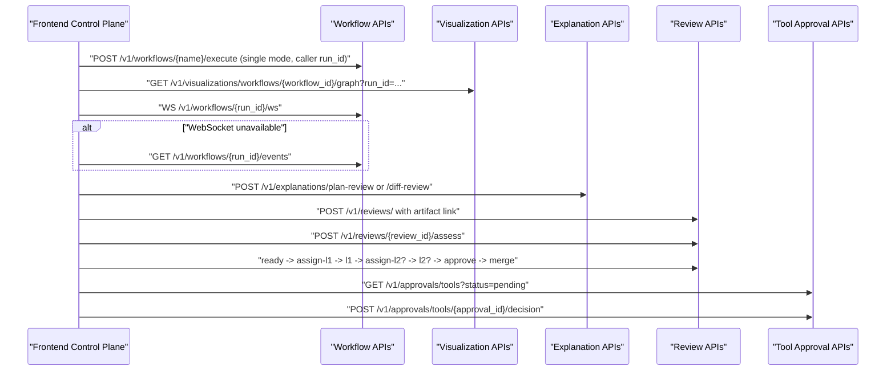

# Phase 25/26 Live Review Walkthrough

This guide documents the operator flow introduced by the Phase 25 live workflow transport and the Phase 26/27 improvement-cycle review wizard stack.

## Scope

- Live workflow execution with run-scoped graph refresh
- WebSocket-first status streaming with authenticated SSE fallback
- Improvement-cycle preset creation
- Explanation artifact generation for `plan_review` and `diff_review`
- Linked review creation, risk assessment, L1/L2 signoff, and final approval
- Pending tool-approval triage inside the same workflow domain

> Note
> This walkthrough reflects the review stack built on `codex/session58-phase26-wizard` and validated in `codex/session60-phase22-docs-validation`. If the related PRs are still open, `main` may not yet expose every surface described here.

## Operator Flow

## Prerequisites

- Backend available at `http://localhost:8000`
- Frontend available at `http://localhost:3000`
- Either a bearer token or API key loaded into the control plane
- The workflow and review scopes enabled for the current operator

## 1. Run a Live Workflow

Open the frontend control plane and navigate to the `workflows` domain.

For a single-run execution:

1. Use the `workflows-execute` operation.
2. Keep execution mode set to `single`.
3. Submit the request.

Expected behavior:

- The client injects a caller-generated `run_id` into the execute payload.
- The workflow graph loads immediately from `GET /v1/visualizations/workflows/{workflow_id}/graph?run_id=...`.
- The control plane opens a live transport connection:
  - first choice: `WS /v1/workflows/{run_id}/ws`
  - fallback: `GET /v1/workflows/{run_id}/events` using authenticated `fetch`
- Graph refreshes occur on `sync`, `step_started`, `step_completed`, `step_failed`, `step_skipped`, `step_retrying`, `workflow_completed`, and `workflow_failed`.

Operational notes:

- The live graph path is only used for single executions.
- The transport closes itself on terminal workflow events.
- The graph endpoint prefers live run snapshots over historical execution history when `run_id` is provided.

## 2. Generate a Review Artifact

In the same `workflows` domain, open the `Improvement Cycle Wizard`.

The `Artifact` stage exposes:

- `Review mode`: `Plan review` or `Diff review`
- `Improvement preset`: sourced from the canonical preset catalog
- `Entity type`
- `Entity ID`
- `Artifact content`

Buttons:

- `Create preset workflow`
- `Generate artifact`

Expected result:

- `plan_review` calls `POST /v1/explanations/plan-review`
- `diff_review` calls `POST /v1/explanations/diff-review`
- Metadata includes the selected branch and preset id
- The returned HTML artifact is previewed inline in a sandboxed iframe

## 3. Create a Linked Review Draft

The `Review Draft` stage binds the generated explanation artifact to a review record.

Inputs:

- `Task ID`
- `Branch`
- Risk-trigger checkboxes such as `Security`, `Api Public`, `Prompt Injection`, and `Supply Chain`

Buttons:

- `Create linked review`
- `Assess selected risk triggers`

Expected result:

- `POST /v1/reviews/` includes:
  - `task_id`
  - `branch`
  - `artifacts: [{ kind: "explanation", artifact_id, label, mode }]`
- `POST /v1/reviews/{review_id}/assess` stores the explicit risk triggers
- The wizard summary updates with:
  - review id
  - current state
  - risk level
  - whether L1 is required
  - whether L2 is required

## 4. Drive the Signoff Lifecycle

The `Signoff` stage maps directly to the review state machine.

Buttons:

- `Mark ready`
- `Assign L1 reviewer`
- `Submit L1`
- `Assign L2 reviewer`
- `Submit L2`
- `Final approval`
- `Mark merged`

Decision controls:

- `L1 decision`
- `L2 decision`
- `Final approver`

Expected behavior:

- L2 controls remain disabled until risk assessment marks `l2_required = true`
- L1 and L2 submissions send checklist payloads along with the chosen decision
- Final approval uses `POST /v1/reviews/{review_id}/approve`
- Merge completion uses `POST /v1/reviews/{review_id}/merge`

## 5. Resolve Pending Tool Approvals

The `Tool Approvals` stage keeps human-in-the-loop approvals inside the same operator flow.

Inputs:

- `Review note`

Buttons:

- `Refresh pending approvals`
- `Approve`
- `Reject`

Expected behavior:

- `GET /v1/approvals/tools?status=pending` lists outstanding approvals
- Each approval card shows:
  - approval id
  - status
  - tool name and operation
  - command preview when present
  - details text
- Decisions are submitted with `POST /v1/approvals/tools/{approval_id}/decision`

## API Map

| Concern | Endpoint |
| --- | --- |
| Execute single workflow | `POST /v1/workflows/{name}/execute` |
| Live workflow WebSocket | `WS /v1/workflows/{run_id}/ws` |
| Live workflow SSE fallback | `GET /v1/workflows/{run_id}/events` |
| Graph overlay for active run | `GET /v1/visualizations/workflows/{workflow_id}/graph?run_id={run_id}` |
| Generate plan review artifact | `POST /v1/explanations/plan-review` |
| Generate diff review artifact | `POST /v1/explanations/diff-review` |
| Create linked review | `POST /v1/reviews/` |
| Assess risk triggers | `POST /v1/reviews/{review_id}/assess` |
| L1 assignment and submission | `POST /v1/reviews/{review_id}/assign-l1`, `POST /v1/reviews/{review_id}/l1` |
| L2 assignment and submission | `POST /v1/reviews/{review_id}/assign-l2`, `POST /v1/reviews/{review_id}/l2` |
| Final approval and merge | `POST /v1/reviews/{review_id}/approve`, `POST /v1/reviews/{review_id}/merge` |
| Pending tool approvals | `GET /v1/approvals/tools?status=pending` |
| Tool approval decision | `POST /v1/approvals/tools/{approval_id}/decision` |

## Source of Truth

- Frontend wizard: `frontend/src/features/improvement-cycle/ImprovementCycleWizard.tsx`
- Live transport client: `frontend/src/lib/workflowLiveTransport.ts`
- Workflow operation integration: `frontend/src/components/OperationCard.tsx`
- Review domain routes: `engine/src/agent33/api/routes/reviews.py`
- Explanation routes: `engine/src/agent33/api/routes/explanations.py`
- Tool approval routes: `engine/src/agent33/api/routes/tool_approvals.py`

